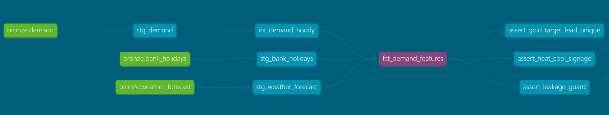

# dbt Lineage

Generated with `dbt docs generate && dbt docs serve` (run from `dbt/` with `--profiles-dir .`).

Bronze sources are raw JSON in S3, catalogued in Glue with partition projection. The
staging models are **views** — stored SQL re-reading bronze at query time, no S3 data of
their own. `int_demand_hourly` and `fct_demand_features` are **tables**, materialised as
Parquet by Athena CTAS.

The three tests on the right are the singular ones; the generic `not_null` tests aren't
drawn. `assert_leakage_guard` is the one that matters — it checks every predictor in the
mart against the timestamp it was actually read from, so the point-in-time claim in the
model description is verified rather than asserted.
